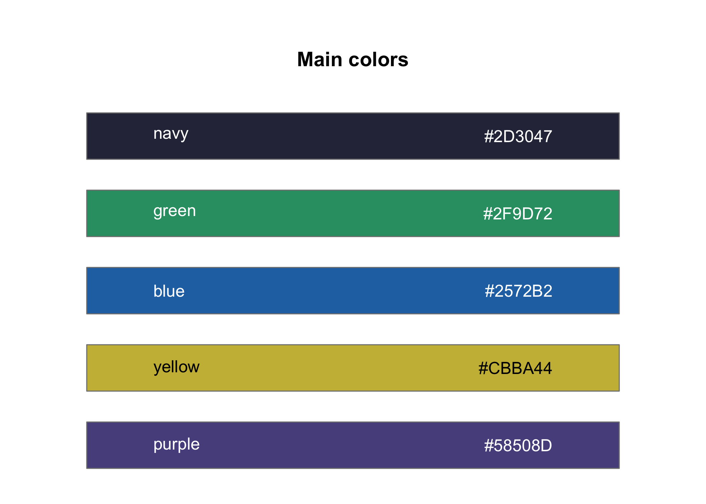
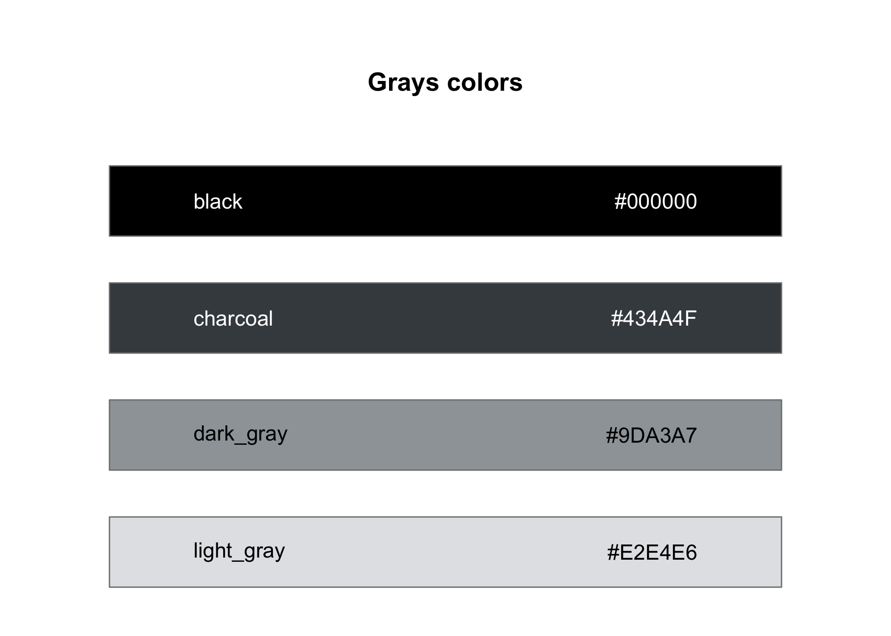
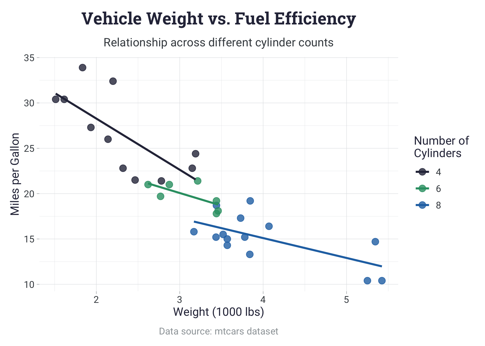
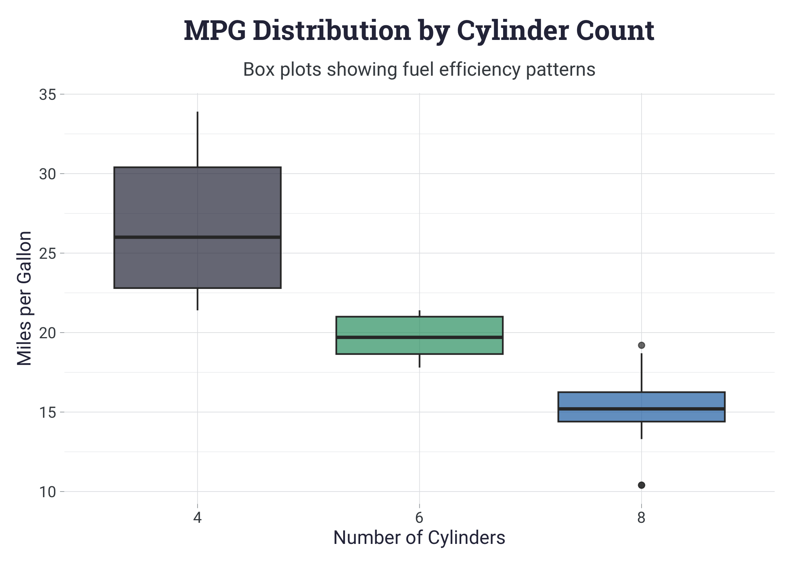
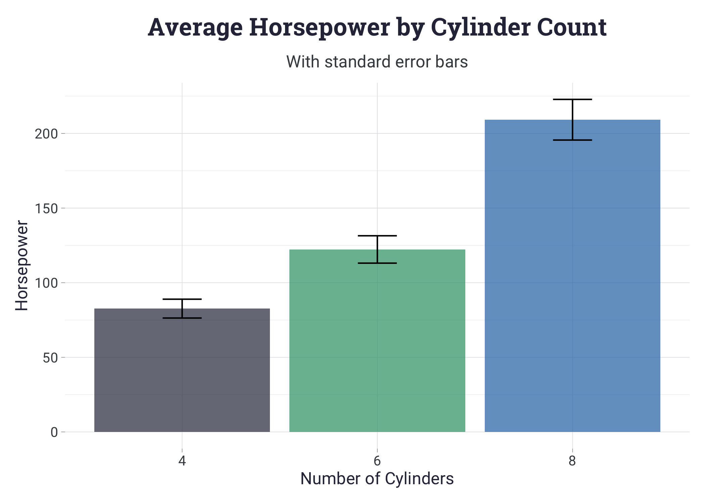

<!-- README.md is generated from README.Rmd. Please edit that file -->

# shubhamPalette

<!-- badges: start -->
<!-- badges: end -->

`shubhamPalette` provides a carefully curated collection of color
palettes and themes for creating beautiful and consistent visualizations
in R. The package includes pre-defined color schemes, convenient palette
generation functions, and a custom ggplot2 theme.

## Installation

You can install the development version of shubhamPalette from GitHub
with:

``` r
pak::pak("shubhamdutta26/shubhamPalette")
```

Load the package:

``` r
library(tidyverse)
library(shubhamPalette)
```

## Color palette usage

The package includes 9 colorblind friendly colors divided into two sets:
“main” and “grays”.

``` r
display_colors_d("main")
```



``` r
display_colors_d("grays")
```



## Use custom theme with ggplot2:

``` r
ggplot(mtcars, aes(x = wt, y = mpg, color = factor(cyl))) +
  geom_point(size = 3, alpha = 0.8) +
  geom_smooth(method = "lm", se = FALSE, alpha = 0.8) +
  theme_shubham() +
  scale_color_shubham_d() +
  labs(
    title = "Vehicle Weight vs. Fuel Efficiency",
    subtitle = "Relationship across different cylinder counts",
    x = "Weight (1000 lbs)",
    y = "Miles per Gallon",
    color = "Number of\nCylinders",
    caption = "Data source: mtcars dataset"
  )
#> `geom_smooth()` using formula = 'y ~ x'
```



``` r
ggplot(mtcars, aes(x = factor(cyl), y = mpg, fill = factor(cyl))) +
  geom_boxplot(alpha = 0.7) +
  theme_shubham() +
  scale_fill_shubham_d() +
  theme(legend.position = "none") +
  labs(
    title = "MPG Distribution by Cylinder Count",
    subtitle = "Box plots showing fuel efficiency patterns",
    x = "Number of Cylinders",
    y = "Miles per Gallon"
  )
```



``` r
cyl_summary <- mtcars %>% 
  group_by(cyl) %>% 
  summarise(
    mean_hp = mean(hp),
    se_hp = sd(hp)/sqrt(n())
  )

ggplot(cyl_summary, aes(x = factor(cyl), y = mean_hp, fill = factor(cyl))) +
  geom_bar(stat = "identity", alpha = 0.7) +
  geom_errorbar(aes(ymin = mean_hp - se_hp, ymax = mean_hp + se_hp),
                width = 0.2) +
  theme_shubham() +
  scale_fill_shubham_d() +
  theme(legend.position = "none") +
  labs(
    title = "Average Horsepower by Cylinder Count",
    subtitle = "With standard error bars",
    x = "Number of Cylinders",
    y = "Horsepower"
  )
```


